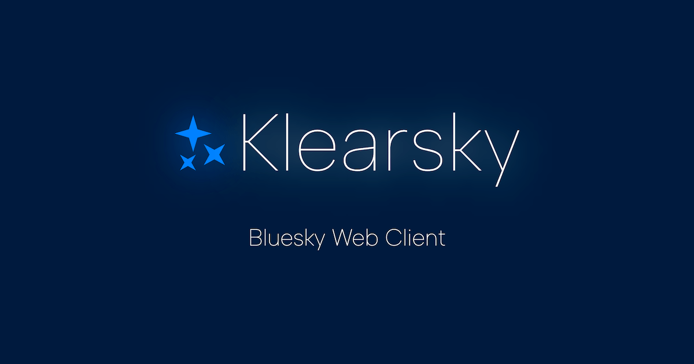

# Klearsky
A design-first web client for the AT Protocol a.k.a. Bluesky.

## GitHub
* Repository: https://github.com/mimonelu/klearsky

## Deployment destination
Klearsky is deployed on Cloudflare.
* Production: https://klearsky.pages.dev/
* Staging: https://staging.klearsky.pages.dev/

## Development environment
* Node: v18.17.1 (based on Cloudflare)
* Framework: Vite + Vue3 (see `package.json` )

## npm run
* `npm run dev` http://localhost:5173/
* `npm run build`
  * `/coproduct/stats.html` rollup-plugin-visualizer によるバンドルファイルの一覧を副次的に生成
* `npm run type-check`
* `npm run knip` https://knip.dev/

## Custom records(collections)
* `space.aoisora.bookmark` Bookmark
* `space.aoisora.preference.feed.extra` to save an index of global feeds

## Custom fields
* `app.bsky.feed.post.record["space.aoisora.post.via"]` Client user agent (Klearsky)
* `app.bsky.feed.post.record["space.aoisora.post.lightning"]` Used in "Zap!" link
* ~~`app.bsky.actor.profile.record.pinnedPost` Used in pinned post~~

## External linkage services
* MyMemory: 自動翻訳で使用。ユーザーのメールアドレスを自動付与している
* Lightning Network: Zap! リンク／ボタンで使用。 `lightning:` プロトコルでリンクしているだけ

## Design resources
* Logo font: https://fonts.google.com/specimen/Albert+Sans?preview.text=Klearsky&preview.size=64&preview.text_type=custom&category=Sans+Serif,Display
* SVG icons: https://pictogrammers.com/library/mdi/

## Media
* Community Showcase: https://docs.bsky.app/showcase?operator=AND&tags=favorite&tags=client&tags=opensource
* AT Protocol Ecosystem: https://github.com/bluesky-social/atproto-ecosystem
* Scrapbox: https://scrapbox.io/Bluesky/%E9%96%A2%E9%80%A3%E3%83%84%E3%83%BC%E3%83%AB
