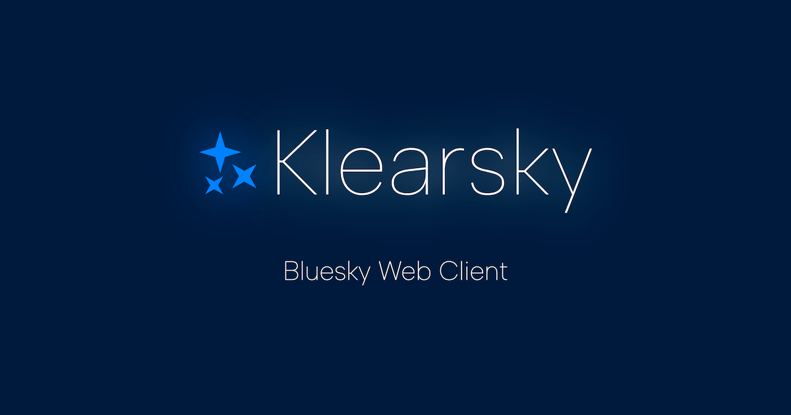

[](https://ko-fi.com/E1E81GN7CG)



# Klearsky

A powerful, feature-packed web client for the AT Protocol (Bluesky) with extensive customization options and advanced functionality.

## ✨ Features

- **🎨 Rich User Interface**: Clean, modern design with extensive customization options
- **🌍 Multi-Language Support**: Available in English, Japanese, French, Korean, and German
- **📱 Responsive Design**: Optimized for desktop, tablet, and mobile devices
- **🔄 Real-Time Sync**: Cross-tab session synchronization using SharedWorker
- **⚡ Performance Optimized**: Advanced caching, lazy loading, and optimized bundle sizes
- **🛡️ Privacy-Focused**: Local data storage with optional cloud synchronization
- **🔧 Advanced Customization**: Extensive settings for feeds, notifications, and UI behavior
- **🔐 OAuth Support**: Bluesky OAuth authentication
- **💬 Chat Support**: Integrated Bluesky chat functionality
- **⚡ Lightning Integration**: Support for Lightning Network "Zap" payments
- **🏷️ Content Labeling**: Advanced content filtering and moderation tools

## 🚀 Quick Start

### Prerequisites

- Node.js v22.16.0 or higher
- npm or yarn package manager

### Installation

1. Clone the repository:
```bash
git clone https://github.com/mimonelu/klearsky.git
cd klearsky
```

2. Install dependencies:
```bash
npm install
```

3. Start the development server:
```bash
npm run dev
```

4. Open your browser to `http://localhost:5173/`

## 🛠️ Development

### Available Scripts

| Command | Description |
|---------|-------------|
| `npm run dev` | Start development server at http://localhost:5173/ |
| `npm run build` | Build for production with type checking |
| `npm run build-only` | Build for production without type checking |
| `npm run type-check` | Run TypeScript type checking |
| `npm run preview` | Preview production build locally |
| `npm run lint` | Run ESLint with auto-fix |

### Tech Stack

- **Framework**: Vue 3 with Composition API
- **Language**: TypeScript
- **Build Tool**: Vite
- **Styling**: SCSS with CSS custom properties
- **State Management**: Vue reactivity with custom composables
- **Routing**: Vue Router 4
- **AT Protocol**: @atproto/api integration
- **Deployment**: Cloudflare Pages

### Architecture

Klearsky uses a modular architecture with the following key components:

- **Composable-Based Logic**: Application logic organized in reusable composables
- **Component Hierarchy**: Well-structured component organization by function
- **State Management**: Reactive global state with specialized sub-managers
- **API Abstraction**: Comprehensive AtpWrapper for AT Protocol interactions
- **Worker-Based Caching**: SharedWorker for cross-tab session management

### Project Structure

```
src/
├── components/          # Reusable UI components organized by function
├── composables/         # Vue composables and application logic
│   ├── atp-wrapper/    # AT Protocol API abstraction layer
│   └── main-state/     # Global state management modules
├── views/              # Page-level Vue components
├── translations/       # i18n translation files (en, ja, fr, ko, de)
├── consts/            # Application constants and configuration
├── plugins/           # Vue plugins and directives
└── scss/              # Global styles and variables
```

For detailed architectural information, see [CLAUDE.md](./CLAUDE.md).

## 🌐 Deployment

### Production
- **Live Site**: https://klearsky.pages.dev/
- **Staging**: https://staging.klearsky.pages.dev/

Klearsky is deployed on Cloudflare Pages with automatic deployments from the main branch.

## 🔧 Custom AT Protocol Extensions

Klearsky implements several custom AT Protocol records and fields:

### Custom Records (Collections)
- `space.aoisora.bookmark` - Custom bookmark system for saving posts
- `net.mimonelu.klearsky.extraFeed` - Storage for trending page and global feed preferences
- `net.mimonelu.klearsky.repostMutes` - Repost mute

### Custom Fields
- `app.bsky.feed.post.record["net.mimonelu.klearsky.via"]` - Client identification (Klearsky)
- `app.bsky.feed.post.record["net.mimonelu.klearsky.lightning"]` - Lightning Network payment integration

## 🔗 External Services

### Integrated Services
- **MyMemory Translation API**: Automatic post translation with user email integration
- **Lightning Network**: Payment integration for "Zap" functionality using `lightning:` protocol links

## 🎨 Design Resources

- **Logo Font**: [Albert Sans](https://fonts.google.com/specimen/Albert+Sans?preview.text=Klearsky&preview.size=64&preview.text_type=custom&category=Sans+Serif,Display)
- **Icons**: [Material Design Icons](https://pictogrammers.com/library/mdi/)

## 📖 Documentation & Community

- **Official Repository**: https://github.com/mimonelu/klearsky
- **Bluesky Community Showcase**: [Featured Client](https://docs.bsky.app/showcase?operator=AND&tags=favorite&tags=client&tags=opensource)
- **AT Protocol Ecosystem**: [Listed Project](https://github.com/bluesky-social/atproto-ecosystem)

## 🤝 Contributing

Contributions are welcome! Please feel free to submit issues, feature requests, or pull requests.

## 📄 License

This project is open source. Please check the license file for details.

---

Built with ❤️ for the Bluesky community
